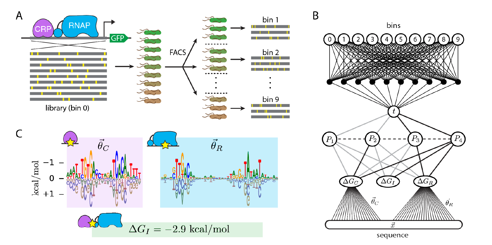
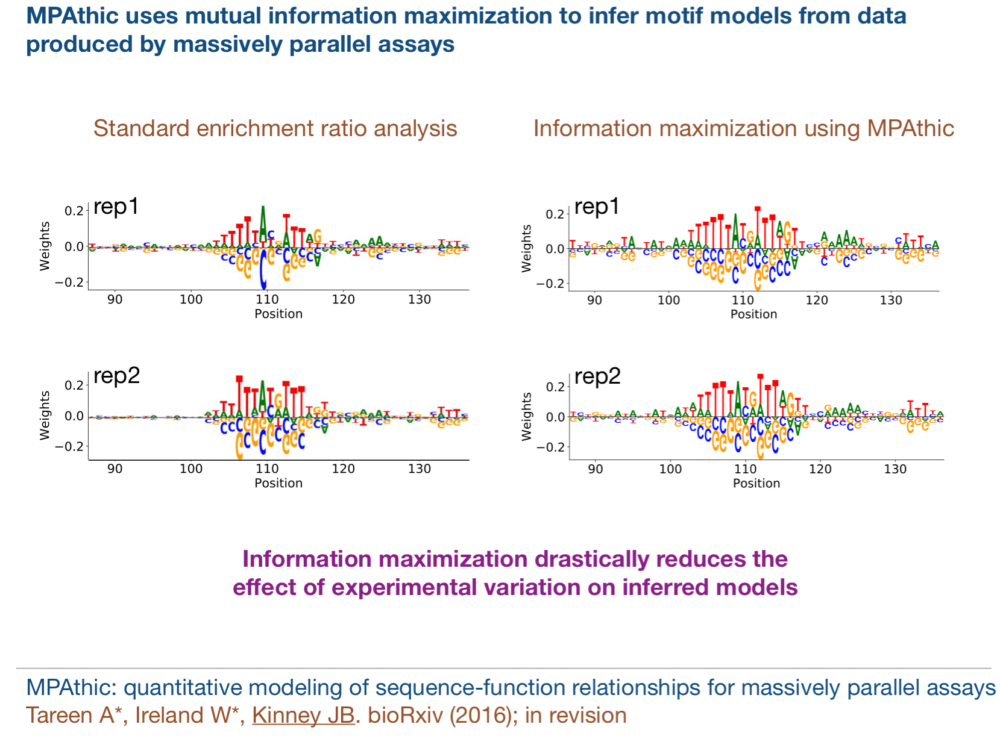
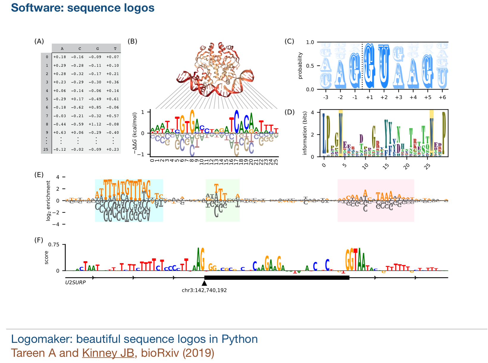

## This page is under development

I am a joint computational postdoc and software developer in bio-physics at Cold Spring Harbor Laboratory. 
I am interested in using machine learning methods to understand sequence-function relationships in massively parallel assays. 
I am also interested in developing methods that help interpret the black-box nature of neural networks. 
   

Inference of a thermodynamic model from MPRA data. (A) Schematic of the sort-seq MPRA of. A
75bp region of the E. coli lac promoter was mutagenized at 12% per nucleotide. Variant promoters were then used to
drive the expression of GFP. Cells carrying these expression constructs were then sorted using FACS, and the variant
sequences in each bin were sequenced. This yielded data on about 50K variant promoters across 10 bins. (B) The
neural network from Fig. 1D, but with delta GC and delta GR expressed as linear functions of the DNA sequence x, as well as
a dense feed-forward network mapping activity t to bins via a probability distribution p(bin|t). Gray lines indicate
weights fixed at 0. The weights in the second and third hidden layers have additional, hardcoded, constraints. (C) The
parameter values inferred for the CRP energy matrix C, the RNAP energy matrix R, and the CRP-RNAP interaction
energy delta GI . Since increasingly negative energy corresponds to stronger binding, they y-axis in the logo plots is
inverted. Logos were generated using Logomaker

<!--  -->